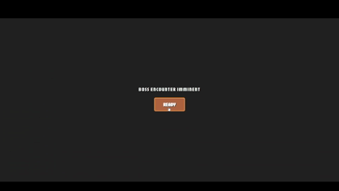

# ProjectArtifact

A web-based Rogue-like RPG built using HTML, CSS, PHP, JavaScript, and SQL. 

---

## Creating Character

When a player builds a fresh character in ProjectArtifact, the system creates a brand-new profile, sets up their combat stats based on their class template, and rolls a personalized map layout for their adventure.

* **Profile Registration:** Characters initialize directly at Level 1, with 0 EXP, and a starting pouch of 200 Gold to spend at dungeon shops.
* **Stat Initialization:** Dynamic stats (`curr_hp`) safely bind directly to the class maximums (`curr_max_hp`), guaranteeing heroes spawn into the world at 100% full health.

---

## World Exploration

Navigate through procedurally generated maps built layer by layer across a 14-column grid canvas. 

* **Procedural Seeding:** Every unique campaign session generates a random seed signature between `100000` and `99999999` to map out your specific layout of rooms.
* **Decision Support System (DSS):** Consult your guide, Mimi, to automatically calculate the most efficient path forward. Choose between the **Safest Path** to avoid danger, the **Greed Path** to hunt for gold, or an **Optimal Path** that dynamically reroutes itself based on your live health conditions.

---

## Using Abilities

Engage in structured turn-based battle mechanics determined entirely by your character's dynamic attributes and speeds.

* **Resource Management:** Balance your active Mana pool costs to unleash standard class skills against layout targets.
* **Strategic Int Procs:** High Intelligence ratings grant passive chances to double your resource generation at the start of clean combat rounds.

---

## Using Ultimates

Turn the tide of tough encounters by unleashing high-impact, signature Ultimate skills when your mana thresholds allow.

* **Stylized Cut-ins:** Activating an ultimate triggers a dramatic, animated eye-glance banner showcase across a dimmed screen.
* **Lethal Status Inflictions:** Ultimates bypass standard defense checks to lay down stacking status penalties, such as Burn, Bleed, or Freezerburn.

---

## Shops

Spend your hard-earned gold coins at local trading posts to stock up your character's equipment and tactical baggage parameters.

* **Consumables Stock:** Purchase valuable potions and restorative item attributes to recover missing health between major skirmishes.
* **Dynamic Penalties:** While highly beneficial, routing through shops adds minimal weight penalty to path algorithms, ensuring a smooth transition into later nodes.

---

## Bosses

Put your strategy and build choices to the ultimate test at the conclusion of your map penance by confronting the regional Stage Boss.

* **Enlarged Fighting Arena:** Boss encounters take place in an expanded, dedicated staging area with custom pixelated high-definition sprites and a centralized health tracking interface.
* **Epic Drop Distribution:** Overcoming a stage boss triggers a rewards evaluation sequence that tallies massive bonus experience and writes unique quest drops—like the Ancient Shattered Artifact—directly into your permanent player inventory.

---

# Project Artifact - Decision Support System (DSS) Berbasis Graph

Proyek ini dikembangkan sebagai pemenuhan Tugas Besar Akhir (UAS) mata kuliah **Struktur Data**. Project Artifact mengimplementasikan struktur data **Graph (Graf)** sebagai fondasi utama dari sebuah *Decision Support System* (DSS) untuk membantu pemain menentukan jalur perjalanan terbaik di dalam dungeon yang dihasilkan secara prosedural (*Procedural Map Generation*).

---

## 📖 1. Studi Kasus
Dalam game *roguelike* prosedural ini, pemain dihadapkan pada 15 kolom rute perjalanan yang saling bercabang. Setiap ruangan (*node*) memiliki tingkat risiko dan hadiah berbeda (*Combat, Elite, Shop, Event,* dan *Boss*). Pemain sering mengalami kesulitan untuk menentukan rute optimal yang sesuai dengan kondisi *real-time* karakter mereka (seperti status HP atau orientasi strategi *farming*).

Untuk mengatasi masalah tersebut, dibangun sebuah sistem penunjang keputusan (**Decision Support System / DSS**) menggunakan **Algoritma Dijkstra** untuk melakukan kalkulasi rute berdasarkan bobot risiko dinamis secara *real-time*.

---

## 📐 2. Pemodelan Graph (Struktur Data)

Aplikasi ini merepresentasikan peta dungeon ke dalam bentuk struktur data **Weighted, Directed Acyclic Graph (DAG)**:
* **Vertices (Node):** Merepresentasikan jenis-jenis ruangan di dalam dungeon.
  * `Start` (Titik Awal)
  * `Combat` (Pertarungan Biasa)
  * `Shop` (Toko Perlengkapan)
  * `Event` (Kejadian Acak)
  * `Boss` (Titik Akhir / Pertempuran Utama)
* **Edges (Sisi/Jalur):** Merepresentasikan koridor penghubung antar ruangan yang digenerasikan menggunakan pendekatan keterikatan tetangga terdekat (*Nearest-Neighbor Edge Connection*).
* **Properties (Sifat Graf):**
  * **Directed (Berarah):** Pemain hanya bisa bergerak maju secara progresif dari kolom $0$ ke kolom $14$ (tidak dapat memutar balik).
  * **Acyclic (Siklis):** Struktur peta dipastikan tidak mengandung siklus tak terbatas (*infinite loops*).
  * **Weighted (Berbobot):** Setiap tipe node diinjeksikan koefisien bobot risiko dinamis berdasarkan pilihan strategi pemain pada menu asisten taktis Mimi.

---

## 🧠 3. Implementasi Algoritma & DSS

Sistem menggunakan **Algoritma Dijkstra** berbasis pencarian linear array pada sisi client (JavaScript) untuk memecahkan jalur dengan akumulasi bobot terkecil menuju titik target akhir (`Boss`).

### ⚙️ Mekanisme Pembobotan Taktis (DSS Mode)
1. **🛡️ Safest Path (Rute Teraman):**
   * Memberikan penalti bobot yang sangat besar pada pertarungan agar dihindari oleh sistem penelusuran.
   * *Matriks Bobot:* `Combat: 15, Elite: 50, Event: 2, Shop: 1`.
   * *Hasil:* Algoritma akan mencari celah rute meliuk demi menghindari monster dan memprioritaskan ruang aman atau pemulihan.
2. **💰 Greed Path (Memaksimalkan Gold):**
   * Membalikkan prioritas untuk mengejar pertarungan biasa maupun elite demi mendapatkan drop loot terbesar.
   * *Matriks Bobot:* `Combat: 2, Elite: 1, Event: 25, Shop: 8`.
   * *Hasil:* Jalur lurus menyala menembus kumpulan musuh untuk mengoptimalkan efisiensi *farming*.
3. **⚖️ Optimal Path (Rekomendasi Pintar AI):**
   * Sistem membaca variabel HP karakter dari database secara *real-time* menggunakan ambang batas (*threshold evaluation*).
   * **Kondisi HP Aman ($>40\%$):** Menerapkan bobot agresif/greed agar pemain bisa terus memperkuat status level dan mengumpulkan emas.
   * **Kondisi HP Kritis ($<40\%$):** Algoritma secara otomatis melakukan *fallback* dan menulis ulang matriks bobot ke mode bertahan hidup (*Safe Mode*) guna menyelamatkan kelangsungan hidup karakter dari kematian.

---

## 📊 4. Kompleksitas Algoritma (Time & Space Complexity)

* **Time Complexity (Kompleksitas Waktu):** Operasi algoritma berjalan pada kompleksitas **$O(V^2)$** di sisi klien karena dipicu oleh fungsi pengurutan barisan antrean linear array (`queue.sort`), di mana $V$ mewakili jumlah total ruangan pada peta dungeon. Mengingat ukuran simpul dibatasi secara ketat di bawah 100 node per level (`totalColumns = 14`), proses kalkulasi lintasan selesai secara instan dalam waktu **< 1ms**.
* **Space Complexity (Kompleksitas Ruang):** **$O(V + E)$** untuk menyimpan seluruh struktur objek kedekatan node dan relasi edge di dalam memori runtime peramban.

---

## 🛠️ 5. Kendala Pengembangan & Solusi Terapan
* **Sinkronisasi Kamera Centering:** Ditemukan bug di mana fungsi kamera tidak dapat membidik posisi aktif awal pemain saat pemuatan ulang benih acak (*seed reset*). 
  * *Solusi:* Memperbarui fungsi interpolasi geometri kamera agar membaca nilai koordinat array data graf mentah secara langsung, menghilangkan ketergantungan pada ID String elemen DOM browser.
* **Integrasi Jalur AI & HP Null:** Terjadi crash sistem DSS di mana nilai HP terbaca 0 karena ketidakcocokan query antartabel relasional saat pembuatan karakter baru. 
  * *Solusi:* Melakukan normalisasi struktur data query gabungan menggunakan klausa *LEFT JOIN* dan memperbarui skrip `player_stats` saat proses registrasi awal agar variabel `curr_hp` dan `curr_max_hp` terisi penuh secara otomatis.

---

## 💻 6. Fitur Unggulan Proyek
* **Visualisasi Interaktif Real-Time:** Jalur rekomendasi langsung menyala terang sebagai garis solid dengan efek neon bercahaya (*glow drop-shadow*) sesaat setelah tombol pilihan diklik.
* **AI/Smart Recommendation:** Penentuan keputusan adaptif yang menyesuaikan diri berdasarkan fluktuasi HP pemain.
* **Procedural Canvas Control:** Mendukung manipulasi interaktif seperti menyeret peta (*canvas dragging*) dan perbesaran kamera (*zooming engine*).

---

## 👥 Kelompok Proyek
* **Kadek Puja Arya Putra** - (2501010120)
* **I Gede Fajar Waradana** - (2501010123)
